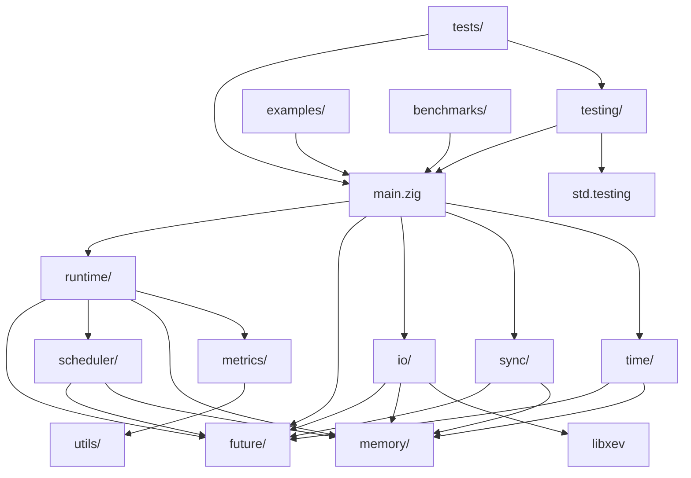

# Zokio 包结构设计和依赖关系

## 项目整体结构

```
zokio/
├── build.zig                    # Zig构建系统配置
├── build.zig.zon               # 依赖管理配置
├── README.md                   # 项目说明
├── LICENSE                     # 开源许可证
├── CHANGELOG.md                # 版本变更日志
├── src/                        # 源代码目录
│   ├── main.zig               # 主入口和公共API导出
│   ├── lib.zig                # 库入口文件
│   ├── runtime/               # 运行时核心模块
│   ├── future/                # Future和异步抽象
│   ├── scheduler/             # 任务调度器
│   ├── io/                    # I/O驱动和网络
│   ├── sync/                  # 同步原语
│   ├── time/                  # 定时器和时间管理
│   ├── memory/                # 内存管理
│   ├── metrics/               # 监控和指标
│   ├── testing/               # 测试工具
│   └── utils/                 # 工具函数
├── tests/                     # 测试代码
│   ├── unit/                  # 单元测试
│   ├── integration/           # 集成测试
│   └── stress/                # 压力测试
├── examples/                  # 示例代码
│   ├── basic/                 # 基础示例
│   ├── network/               # 网络编程示例
│   ├── performance/           # 性能示例
│   └── advanced/              # 高级用法示例
├── benchmarks/                # 性能基准测试
│   ├── micro/                 # 微基准测试
│   ├── macro/                 # 宏基准测试
│   └── comparison/            # 与其他运行时对比
├── docs/                      # 文档
│   ├── api/                   # API文档
│   ├── guides/                # 使用指南
│   ├── design/                # 设计文档
│   └── performance/           # 性能分析
├── tools/                     # 开发工具
│   ├── profiler/              # 性能分析工具
│   ├── debugger/              # 调试工具
│   └── generator/             # 代码生成工具
└── vendor/                    # 第三方依赖
    └── libxev/                # libxev子模块
```

## 核心模块详细设计

### 1. 主入口模块 (src/main.zig)

```zig
//! Zokio异步运行时主入口
//! 提供统一的公共API接口

const std = @import("std");

// 核心模块导出
pub const runtime = @import("runtime/runtime.zig");
pub const future = @import("future/future.zig");
pub const scheduler = @import("scheduler/scheduler.zig");
pub const io = @import("io/io.zig");
pub const sync = @import("sync/sync.zig");
pub const time = @import("time/time.zig");
pub const net = @import("io/net/net.zig");
pub const fs = @import("io/fs/fs.zig");

// 类型别名导出
pub const Runtime = runtime.Runtime;
pub const Future = future.Future;
pub const Poll = future.Poll;
pub const Waker = future.Waker;
pub const Context = future.Context;

// 便捷函数导出
pub const spawn = runtime.spawn;
pub const block_on = runtime.block_on;
pub const async_fn = future.async_fn;
pub const await = future.await;
pub const join_all = future.join_all;
pub const select = future.select;

// 配置类型
pub const RuntimeConfig = runtime.RuntimeConfig;

// 测试工具导出
pub const testing = @import("testing/testing.zig");

// 版本信息
pub const version = @import("version.zig").version;

test {
    // 引用所有测试
    std.testing.refAllDecls(@This());
}
```

### 2. 运行时核心模块 (src/runtime/)

```
src/runtime/
├── runtime.zig              # 运行时主结构
├── config.zig               # 配置管理
├── executor.zig             # 执行器实现
├── worker.zig               # 工作线程
├── task.zig                 # 任务抽象
└── lifecycle.zig            # 生命周期管理
```

#### 2.1 运行时主结构 (src/runtime/runtime.zig)
```zig
//! 异步运行时核心实现
//! 负责协调调度器、I/O驱动和内存管理

const std = @import("std");
const config = @import("config.zig");
const scheduler = @import("../scheduler/scheduler.zig");
const io_driver = @import("../io/driver.zig");
const memory = @import("../memory/allocator.zig");

pub fn Runtime(comptime runtime_config: config.RuntimeConfig) type {
    return struct {
        const Self = @This();
        
        // 核心组件
        scheduler: scheduler.Scheduler(runtime_config),
        io_driver: io_driver.IoDriver,
        allocator: memory.RuntimeAllocator,
        
        // 状态管理
        state: std.atomic.Value(State),
        
        const State = enum(u8) {
            initializing,
            running,
            shutting_down,
            stopped,
        };
        
        pub fn init(base_allocator: std.mem.Allocator) !Self {
            // 初始化实现
        }
        
        pub fn deinit(self: *Self) void {
            // 清理实现
        }
        
        pub fn blockOn(self: *Self, future: anytype) !@TypeOf(future).ReturnType {
            // 阻塞执行实现
        }
        
        pub fn spawn(self: *Self, future: anytype) !TaskHandle {
            // 任务生成实现
        }
    };
}
```

### 3. Future和异步抽象模块 (src/future/)

```
src/future/
├── future.zig               # Future核心实现
├── poll.zig                 # Poll类型定义
├── waker.zig                # 唤醒器实现
├── context.zig              # 执行上下文
├── combinators.zig          # 组合子实现
├── state_machine.zig        # 状态机生成器
└── async_fn.zig             # 异步函数宏
```

### 4. 任务调度器模块 (src/scheduler/)

```
src/scheduler/
├── scheduler.zig            # 调度器主实现
├── work_queue.zig           # 工作队列
├── work_stealing.zig        # 工作窃取算法
├── priority.zig             # 优先级管理
├── affinity.zig             # CPU亲和性
└── numa.zig                 # NUMA感知优化
```

### 5. I/O驱动模块 (src/io/)

```
src/io/
├── io.zig                   # I/O模块主入口
├── driver.zig               # I/O驱动抽象
├── operation.zig            # I/O操作定义
├── backends/                # 平台特定后端
│   ├── io_uring.zig        # Linux io_uring
│   ├── kqueue.zig          # macOS/BSD kqueue
│   ├── epoll.zig           # Linux epoll
│   ├── iocp.zig            # Windows IOCP
│   └── wasi.zig            # WASI支持
├── net/                     # 网络编程
│   ├── net.zig             # 网络模块入口
│   ├── tcp.zig             # TCP支持
│   ├── udp.zig             # UDP支持
│   ├── address.zig         # 地址解析
│   ├── dns.zig             # DNS解析
│   └── pool.zig            # 连接池
├── fs/                      # 文件系统
│   ├── fs.zig              # 文件系统入口
│   ├── file.zig            # 文件操作
│   ├── directory.zig       # 目录操作
│   └── watch.zig           # 文件监控
└── buffer.zig               # 缓冲区管理
```

### 6. 同步原语模块 (src/sync/)

```
src/sync/
├── sync.zig                 # 同步模块入口
├── channel.zig              # 异步通道
├── mutex.zig                # 异步互斥锁
├── rwlock.zig               # 异步读写锁
├── semaphore.zig            # 异步信号量
├── barrier.zig              # 异步屏障
├── condvar.zig              # 异步条件变量
└── once.zig                 # 一次性初始化
```

### 7. 时间管理模块 (src/time/)

```
src/time/
├── time.zig                 # 时间模块入口
├── timer.zig                # 定时器实现
├── wheel.zig                # 时间轮算法
├── timeout.zig              # 超时处理
├── instant.zig              # 时间点
├── duration.zig             # 时间间隔
└── mock.zig                 # 模拟时间(测试用)
```

## 依赖关系图



## 外部依赖管理

### build.zig.zon 配置
```zig
.{
    .name = "zokio",
    .version = "0.1.0",
    .minimum_zig_version = "0.14.0",
    
    .dependencies = .{
        .libxev = .{
            .url = "https://github.com/mitchellh/libxev/archive/main.tar.gz",
            .hash = "1234567890abcdef...",
        },
        .zig_network = .{
            .url = "https://github.com/MasterQ32/zig-network/archive/master.tar.gz",
            .hash = "abcdef1234567890...",
            .lazy = true,
        },
    },
    
    .paths = .{
        "build.zig",
        "build.zig.zon",
        "src",
        "tests",
        "examples",
        "README.md",
        "LICENSE",
    },
}
```

### 依赖版本策略
- **libxev**: 核心依赖，固定版本，定期更新
- **zig-network**: 可选依赖，用于高级网络功能
- **标准库**: 跟随Zig版本，最低支持0.14.0
- **测试依赖**: 仅在开发时需要

## 模块间接口设计

### 1. 核心接口约定
```zig
// 所有异步操作都返回Future
pub fn AsyncOperation(comptime T: type) type {
    return Future(T);
}

// 统一的错误类型
pub const ZokioError = error{
    RuntimeShutdown,
    TaskCancelled,
    Timeout,
    ResourceExhausted,
    IoError,
    NetworkError,
    FileSystemError,
};

// 统一的配置接口
pub fn Config(comptime T: type) type {
    return struct {
        pub fn validate(self: T) !void;
        pub fn withDefaults() T;
    };
}
```

### 2. 内存管理接口
```zig
// 统一的分配器接口
pub const AllocatorInterface = struct {
    allocFn: *const fn(ctx: *anyopaque, len: usize, alignment: u8) ?[*]u8,
    resizeFn: *const fn(ctx: *anyopaque, buf: []u8, new_len: usize, alignment: u8) bool,
    freeFn: *const fn(ctx: *anyopaque, buf: []u8, alignment: u8) void,
    ctx: *anyopaque,
};
```

### 3. 监控接口
```zig
// 统一的指标收集接口
pub const MetricsInterface = struct {
    recordCounter: *const fn(name: []const u8, value: u64) void,
    recordGauge: *const fn(name: []const u8, value: f64) void,
    recordHistogram: *const fn(name: []const u8, value: f64) void,
};
```

## 编译配置和特性开关

### build.zig 特性配置
```zig
pub fn build(b: *std.Build) void {
    const target = b.standardTargetOptions(.{});
    const optimize = b.standardOptimizeOption(.{});
    
    // 特性开关
    const enable_metrics = b.option(bool, "metrics", "Enable runtime metrics") orelse true;
    const enable_tracing = b.option(bool, "tracing", "Enable distributed tracing") orelse false;
    const enable_numa = b.option(bool, "numa", "Enable NUMA awareness") orelse true;
    const enable_io_uring = b.option(bool, "io_uring", "Enable io_uring support") orelse true;
    
    const options = b.addOptions();
    options.addOption(bool, "enable_metrics", enable_metrics);
    options.addOption(bool, "enable_tracing", enable_tracing);
    options.addOption(bool, "enable_numa", enable_numa);
    options.addOption(bool, "enable_io_uring", enable_io_uring);
    
    const lib = b.addStaticLibrary(.{
        .name = "zokio",
        .root_source_file = b.path("src/lib.zig"),
        .target = target,
        .optimize = optimize,
    });
    
    lib.root_module.addOptions("config", options);
    lib.root_module.addImport("libxev", libxev_dep.module("libxev"));
    
    b.installArtifact(lib);
}
```

## 测试策略和组织

### 测试分层结构
1. **单元测试**: 每个模块内部的测试
2. **集成测试**: 模块间交互测试
3. **端到端测试**: 完整功能测试
4. **性能测试**: 基准测试和压力测试
5. **兼容性测试**: 跨平台兼容性验证

### 测试命名约定
- 单元测试: `test "module_function_scenario"`
- 集成测试: `test "integration_module1_module2_scenario"`
- 性能测试: `benchmark "operation_name"`

## 详细模块实现规范

### 8. 内存管理模块 (src/memory/)

```
src/memory/
├── memory.zig               # 内存模块入口
├── allocator.zig            # 运行时分配器
├── pool.zig                 # 对象池实现
├── stack.zig                # 栈分配器
├── arena.zig                # 竞技场分配器
├── slab.zig                 # Slab分配器
├── numa.zig                 # NUMA感知分配
└── tracking.zig             # 内存使用追踪
```

#### 8.1 分配器层次结构
```zig
// src/memory/allocator.zig
pub const RuntimeAllocator = struct {
    // 基础分配器
    base: std.mem.Allocator,

    // 专用分配器
    task_pool: pool.ObjectPool(Task),
    future_pool: pool.ObjectPool(Future),
    buffer_pool: pool.BufferPool,
    stack_allocator: stack.StackAllocator,

    // NUMA感知分配器
    numa_allocators: ?[]numa.NumaAllocator,

    // 内存追踪
    tracker: tracking.MemoryTracker,

    pub fn init(base_allocator: std.mem.Allocator, config: AllocatorConfig) !RuntimeAllocator {
        // 初始化各种专用分配器
    }

    // 类型安全的分配接口
    pub fn allocTask(self: *Self) !*Task {
        return self.task_pool.acquire();
    }

    pub fn allocFuture(self: *Self, comptime T: type) !*Future(T) {
        return self.future_pool.acquire();
    }

    pub fn allocBuffer(self: *Self, size: usize) ![]u8 {
        return self.buffer_pool.acquire(size);
    }
};
```

### 9. 监控和指标模块 (src/metrics/)

```
src/metrics/
├── metrics.zig              # 指标模块入口
├── runtime_metrics.zig      # 运行时指标
├── collector.zig            # 指标收集器
├── exporter.zig             # 指标导出器
├── prometheus.zig           # Prometheus格式
├── tracing.zig              # 分布式追踪
└── profiler.zig             # 性能分析器
```

#### 9.1 指标收集系统
```zig
// src/metrics/runtime_metrics.zig
pub const RuntimeMetrics = struct {
    // 任务相关指标
    tasks: TaskMetrics,

    // 调度器指标
    scheduler: SchedulerMetrics,

    // I/O指标
    io: IoMetrics,

    // 内存指标
    memory: MemoryMetrics,

    // 网络指标
    network: NetworkMetrics,

    const TaskMetrics = struct {
        spawned: std.atomic.Value(u64) = std.atomic.Value(u64).init(0),
        completed: std.atomic.Value(u64) = std.atomic.Value(u64).init(0),
        cancelled: std.atomic.Value(u64) = std.atomic.Value(u64).init(0),
        panicked: std.atomic.Value(u64) = std.atomic.Value(u64).init(0),

        // 任务执行时间分布
        execution_time_histogram: Histogram,

        pub fn recordTaskSpawned(self: *Self) void {
            _ = self.spawned.fetchAdd(1, .monotonic);
        }

        pub fn recordTaskCompleted(self: *Self, execution_time_ns: u64) void {
            _ = self.completed.fetchAdd(1, .monotonic);
            self.execution_time_histogram.record(execution_time_ns);
        }
    };

    pub fn exportPrometheus(self: *const Self, writer: anytype) !void {
        // 导出Prometheus格式的指标
        try writer.print("# HELP zokio_tasks_total Total number of tasks\n");
        try writer.print("# TYPE zokio_tasks_total counter\n");
        try writer.print("zokio_tasks_spawned {}\n", .{self.tasks.spawned.load(.monotonic)});
        try writer.print("zokio_tasks_completed {}\n", .{self.tasks.completed.load(.monotonic)});

        // 更多指标导出...
    }
};
```

### 10. 测试工具模块 (src/testing/)

```
src/testing/
├── testing.zig              # 测试工具入口
├── async_test.zig           # 异步测试框架
├── mock_time.zig            # 模拟时间
├── mock_io.zig              # 模拟I/O
├── mock_network.zig         # 模拟网络
├── stress.zig               # 压力测试工具
└── benchmark.zig            # 基准测试工具
```

#### 10.1 异步测试框架
```zig
// src/testing/async_test.zig
pub fn asyncTest(comptime test_fn: anytype) void {
    var runtime = Runtime(.{
        .worker_threads = 1,
        .enable_testing = true,
    }).init(std.testing.allocator) catch unreachable;
    defer runtime.deinit();

    const result = runtime.blockOn(test_fn());
    result catch |err| {
        std.debug.panic("Async test failed: {}", .{err});
    };
}

// 测试断言宏
pub const expectAsync = struct {
    pub fn equal(comptime T: type, expected: T, actual: Future(T)) Future(void) {
        return async_fn(struct {
            expected: T,
            actual: Future(T),

            fn run(self: @This()) !void {
                const actual_value = try await self.actual;
                try std.testing.expectEqual(self.expected, actual_value);
            }
        }{ .expected = expected, .actual = actual }.run);
    }

    pub fn errorAsync(comptime E: type, future: anytype) Future(void) {
        return async_fn(struct {
            future: @TypeOf(future),

            fn run(self: @This()) !void {
                const result = await self.future;
                try std.testing.expectError(E, result);
            }
        }{ .future = future }.run);
    }
};
```

### 11. 工具函数模块 (src/utils/)

```
src/utils/
├── utils.zig                # 工具模块入口
├── atomic.zig               # 原子操作工具
├── intrusive.zig            # 侵入式数据结构
├── hash.zig                 # 哈希函数
├── random.zig               # 随机数生成
├── cpu.zig                  # CPU相关工具
├── platform.zig             # 平台检测
└── debug.zig                # 调试工具
```

## 模块依赖关系详细分析

### 1. 核心依赖层次
```
Level 0 (基础层):
├── utils/          # 基础工具函数
├── memory/         # 内存管理
└── platform/       # 平台抽象

Level 1 (抽象层):
├── future/         # 异步抽象 (依赖: utils, memory)
├── time/           # 时间管理 (依赖: utils, memory)
└── metrics/        # 监控指标 (依赖: utils, memory)

Level 2 (核心层):
├── scheduler/      # 任务调度 (依赖: future, memory, utils)
├── io/             # I/O驱动 (依赖: future, memory, utils, libxev)
└── sync/           # 同步原语 (依赖: future, memory, utils)

Level 3 (运行时层):
└── runtime/        # 运行时 (依赖: scheduler, io, sync, metrics)

Level 4 (应用层):
├── net/            # 网络编程 (依赖: io, runtime)
├── fs/             # 文件系统 (依赖: io, runtime)
└── testing/        # 测试工具 (依赖: runtime)
```

### 2. 循环依赖检测和避免
```zig
// 使用编译时检查避免循环依赖
comptime {
    // 检查模块依赖图是否有环
    const dependency_graph = buildDependencyGraph();
    if (hasCycle(dependency_graph)) {
        @compileError("Circular dependency detected in module graph");
    }
}

fn buildDependencyGraph() DependencyGraph {
    // 构建模块依赖图
    var graph = DependencyGraph.init();

    // 添加依赖关系
    graph.addDependency("runtime", "scheduler");
    graph.addDependency("runtime", "io");
    graph.addDependency("scheduler", "future");
    // ... 更多依赖关系

    return graph;
}
```

### 3. 接口稳定性保证
```zig
// 版本化的接口定义
pub const InterfaceVersion = struct {
    major: u32,
    minor: u32,
    patch: u32,

    pub const CURRENT = InterfaceVersion{
        .major = 1,
        .minor = 0,
        .patch = 0,
    };

    pub fn isCompatible(self: InterfaceVersion, other: InterfaceVersion) bool {
        return self.major == other.major and self.minor >= other.minor;
    }
};

// 接口兼容性检查
pub fn checkInterfaceCompatibility(comptime required: InterfaceVersion) void {
    if (!InterfaceVersion.CURRENT.isCompatible(required)) {
        @compileError("Interface version mismatch");
    }
}
```

## 构建系统详细配置

### 1. 主构建文件 (build.zig)
```zig
const std = @import("std");
const builtin = @import("builtin");

pub fn build(b: *std.Build) void {
    const target = b.standardTargetOptions(.{});
    const optimize = b.standardOptimizeOption(.{});

    // 特性配置
    const features = buildFeatures(b);

    // 依赖管理
    const deps = buildDependencies(b);

    // 主库构建
    const lib = buildMainLibrary(b, target, optimize, features, deps);

    // 测试构建
    buildTests(b, target, optimize, features, deps);

    // 示例构建
    buildExamples(b, target, optimize, lib);

    // 基准测试构建
    buildBenchmarks(b, target, optimize, lib);

    // 文档生成
    buildDocs(b, lib);
}

fn buildFeatures(b: *std.Build) Features {
    return Features{
        .enable_metrics = b.option(bool, "metrics", "Enable runtime metrics") orelse true,
        .enable_tracing = b.option(bool, "tracing", "Enable distributed tracing") orelse false,
        .enable_numa = b.option(bool, "numa", "Enable NUMA awareness") orelse detectNuma(),
        .enable_io_uring = b.option(bool, "io_uring", "Enable io_uring support") orelse detectIoUring(),
        .enable_simd = b.option(bool, "simd", "Enable SIMD optimizations") orelse true,
        .debug_mode = b.option(bool, "debug", "Enable debug mode") orelse false,
    };
}

fn buildDependencies(b: *std.Build) Dependencies {
    const libxev = b.dependency("libxev", .{});

    return Dependencies{
        .libxev = libxev,
        .zig_network = if (features.enable_advanced_networking)
            b.dependency("zig_network", .{})
        else
            null,
    };
}
```

### 2. 条件编译配置
```zig
// src/config.zig - 编译时配置
const builtin = @import("builtin");
const build_options = @import("build_options");

pub const Config = struct {
    // 平台特性
    pub const has_io_uring = builtin.os.tag == .linux and build_options.enable_io_uring;
    pub const has_kqueue = builtin.os.tag.isDarwin() or builtin.os.tag.isBSD();
    pub const has_iocp = builtin.os.tag == .windows;

    // 性能特性
    pub const enable_simd = build_options.enable_simd and builtin.cpu.arch.isX86();
    pub const enable_numa = build_options.enable_numa and builtin.os.tag == .linux;

    // 调试特性
    pub const enable_metrics = build_options.enable_metrics;
    pub const enable_tracing = build_options.enable_tracing;
    pub const debug_mode = build_options.debug_mode or builtin.mode == .Debug;

    // 编译时验证
    comptime {
        if (!has_io_uring and !has_kqueue and !has_iocp) {
            @compileError("No supported I/O backend available for this platform");
        }
    }
};
```

## 版本管理和发布策略

### 1. 语义化版本控制
```zig
// src/version.zig
pub const Version = struct {
    major: u32,
    minor: u32,
    patch: u32,
    pre_release: ?[]const u8 = null,
    build_metadata: ?[]const u8 = null,

    pub const CURRENT = Version{
        .major = 0,
        .minor = 1,
        .patch = 0,
        .pre_release = "alpha",
    };

    pub fn toString(self: Version, allocator: std.mem.Allocator) ![]u8 {
        if (self.pre_release) |pre| {
            return std.fmt.allocPrint(allocator, "{}.{}.{}-{}", .{
                self.major, self.minor, self.patch, pre
            });
        } else {
            return std.fmt.allocPrint(allocator, "{}.{}.{}", .{
                self.major, self.minor, self.patch
            });
        }
    }

    pub fn isCompatible(self: Version, required: Version) bool {
        if (self.major != required.major) return false;
        if (self.minor < required.minor) return false;
        return true;
    }
};
```

### 2. API稳定性保证
```zig
// API版本控制
pub const ApiVersion = enum(u32) {
    v1_0 = 100,
    v1_1 = 101,
    v2_0 = 200,

    pub const CURRENT = ApiVersion.v1_0;

    pub fn isSupported(version: ApiVersion) bool {
        return switch (version) {
            .v1_0, .v1_1 => true,
            else => false,
        };
    }
};

// 向后兼容性检查
pub fn checkApiCompatibility(comptime required_version: ApiVersion) void {
    if (!required_version.isSupported()) {
        @compileError("Unsupported API version: " ++ @tagName(required_version));
    }
}
```

## 文档和示例组织

### 1. 文档结构 (docs/)
```
docs/
├── README.md                # 项目总览
├── GETTING_STARTED.md       # 快速开始指南
├── INSTALLATION.md          # 安装说明
├── api/                     # API文档
│   ├── runtime.md          # 运行时API
│   ├── future.md           # Future API
│   ├── io.md               # I/O API
│   ├── sync.md             # 同步原语API
│   └── net.md              # 网络API
├── guides/                  # 使用指南
│   ├── basic_usage.md      # 基础用法
│   ├── async_patterns.md   # 异步编程模式
│   ├── performance.md      # 性能优化指南
│   ├── testing.md          # 测试指南
│   └── deployment.md       # 部署指南
├── design/                  # 设计文档
│   ├── architecture.md     # 架构设计
│   ├── scheduler.md        # 调度器设计
│   ├── io_driver.md        # I/O驱动设计
│   └── memory.md           # 内存管理设计
├── examples/                # 示例文档
│   ├── echo_server.md      # Echo服务器示例
│   ├── http_server.md      # HTTP服务器示例
│   ├── chat_server.md      # 聊天服务器示例
│   └── file_processor.md   # 文件处理示例
└── internals/               # 内部实现文档
    ├── task_lifecycle.md   # 任务生命周期
    ├── io_polling.md       # I/O轮询机制
    └── memory_layout.md    # 内存布局
```

### 2. 示例代码组织 (examples/)
```
examples/
├── basic/                   # 基础示例
│   ├── hello_world.zig     # Hello World
│   ├── simple_task.zig     # 简单任务
│   ├── timer_example.zig   # 定时器使用
│   └── error_handling.zig  # 错误处理
├── network/                 # 网络编程示例
│   ├── tcp_echo_server.zig # TCP Echo服务器
│   ├── tcp_client.zig      # TCP客户端
│   ├── udp_server.zig      # UDP服务器
│   ├── http_server.zig     # HTTP服务器
│   ├── websocket_server.zig # WebSocket服务器
│   └── proxy_server.zig    # 代理服务器
├── filesystem/              # 文件系统示例
│   ├── file_reader.zig     # 文件读取
│   ├── file_watcher.zig    # 文件监控
│   ├── directory_walker.zig # 目录遍历
│   └── log_processor.zig   # 日志处理
├── concurrency/             # 并发示例
│   ├── producer_consumer.zig # 生产者消费者
│   ├── worker_pool.zig     # 工作池
│   ├── pipeline.zig        # 管道处理
│   └── map_reduce.zig      # MapReduce
├── performance/             # 性能示例
│   ├── high_throughput.zig # 高吞吐量服务器
│   ├── low_latency.zig     # 低延迟服务器
│   ├── memory_efficient.zig # 内存高效示例
│   └── cpu_intensive.zig   # CPU密集型任务
└── advanced/                # 高级示例
    ├── custom_executor.zig  # 自定义执行器
    ├── plugin_system.zig    # 插件系统
    ├── distributed_system.zig # 分布式系统
    └── game_server.zig      # 游戏服务器
```

### 3. 自动文档生成
```zig
// build.zig中的文档生成配置
fn buildDocs(b: *std.Build, lib: *std.Build.Step.Compile) void {
    const docs = b.addTest(.{
        .root_source_file = b.path("src/main.zig"),
        .target = b.host,
        .optimize = .Debug,
    });

    docs.root_module.addImport("zokio", lib.root_module);

    const docs_step = b.step("docs", "Generate documentation");
    const docs_install = b.addInstallDirectory(.{
        .source_dir = docs.getEmittedDocs(),
        .install_dir = .prefix,
        .install_subdir = "docs",
    });

    docs_step.dependOn(&docs_install.step);
    docs_install.step.dependOn(&docs.step);
}
```

## CI/CD流水线配置

### 1. GitHub Actions配置 (.github/workflows/)
```yaml
# .github/workflows/ci.yml
name: CI

on:
  push:
    branches: [ main, develop ]
  pull_request:
    branches: [ main ]

jobs:
  test:
    strategy:
      matrix:
        os: [ubuntu-latest, macos-latest, windows-latest]
        zig-version: ['0.14.0', 'master']

    runs-on: ${{ matrix.os }}

    steps:
    - uses: actions/checkout@v4
      with:
        submodules: recursive

    - name: Setup Zig
      uses: goto-bus-stop/setup-zig@v2
      with:
        version: ${{ matrix.zig-version }}

    - name: Run tests
      run: |
        zig build test
        zig build test-integration
        zig build test-stress

    - name: Run benchmarks
      run: zig build benchmark

    - name: Check formatting
      run: zig fmt --check src/

    - name: Generate docs
      run: zig build docs

    - name: Upload coverage
      if: matrix.os == 'ubuntu-latest'
      uses: codecov/codecov-action@v3

  security:
    runs-on: ubuntu-latest
    steps:
    - uses: actions/checkout@v4
    - name: Security audit
      run: |
        # 安全扫描工具
        zig build security-check
```

### 2. 发布流水线
```yaml
# .github/workflows/release.yml
name: Release

on:
  push:
    tags:
      - 'v*'

jobs:
  release:
    runs-on: ubuntu-latest
    steps:
    - uses: actions/checkout@v4

    - name: Setup Zig
      uses: goto-bus-stop/setup-zig@v2
      with:
        version: '0.14.0'

    - name: Build release artifacts
      run: |
        zig build -Doptimize=ReleaseFast
        zig build -Doptimize=ReleaseSmall

    - name: Run full test suite
      run: |
        zig build test-all
        zig build benchmark-release

    - name: Create release
      uses: actions/create-release@v1
      with:
        tag_name: ${{ github.ref }}
        release_name: Release ${{ github.ref }}
        draft: false
        prerelease: false
```

## 社区管理和贡献指南

### 1. 贡献指南 (CONTRIBUTING.md)
```markdown
# 贡献指南

## 开发环境设置
1. 安装Zig 0.14.0或更高版本
2. 克隆仓库: `git clone --recursive https://github.com/zokio/zokio.git`
3. 运行测试: `zig build test`

## 代码规范
- 使用`zig fmt`格式化代码
- 遵循Zig官方命名约定
- 添加适当的文档注释
- 确保所有测试通过

## 提交流程
1. Fork仓库
2. 创建特性分支
3. 提交更改
4. 创建Pull Request
5. 等待代码审查

## 代码审查标准
- 功能正确性
- 性能影响
- 内存安全
- API设计
- 测试覆盖率
```

### 2. 问题模板 (.github/ISSUE_TEMPLATE/)
```yaml
# bug_report.yml
name: Bug Report
description: Report a bug in Zokio
body:
  - type: markdown
    attributes:
      value: |
        Thanks for taking the time to fill out this bug report!

  - type: input
    id: version
    attributes:
      label: Zokio Version
      description: What version of Zokio are you using?
      placeholder: v0.1.0
    validations:
      required: true

  - type: textarea
    id: description
    attributes:
      label: Bug Description
      description: A clear description of what the bug is
    validations:
      required: true

  - type: textarea
    id: reproduction
    attributes:
      label: Reproduction Steps
      description: Steps to reproduce the behavior
      placeholder: |
        1. Create a new project
        2. Add Zokio dependency
        3. Run the code
        4. See error
    validations:
      required: true

  - type: textarea
    id: expected
    attributes:
      label: Expected Behavior
      description: What you expected to happen
    validations:
      required: true

  - type: textarea
    id: environment
    attributes:
      label: Environment
      description: |
        - OS: [e.g. Ubuntu 22.04]
        - Zig version: [e.g. 0.14.0]
        - Architecture: [e.g. x86_64]
```

### 3. 性能基准测试框架
```zig
// benchmarks/framework.zig
const std = @import("std");
const zokio = @import("zokio");

pub const BenchmarkConfig = struct {
    name: []const u8,
    iterations: u32 = 1000,
    warmup_iterations: u32 = 100,
    timeout_ms: u64 = 30000,
};

pub fn benchmark(comptime config: BenchmarkConfig, comptime bench_fn: anytype) !void {
    var timer = try std.time.Timer.start();

    // 预热
    for (0..config.warmup_iterations) |_| {
        _ = try bench_fn();
    }

    // 实际测试
    timer.reset();
    for (0..config.iterations) |_| {
        _ = try bench_fn();
    }

    const elapsed_ns = timer.read();
    const avg_ns = elapsed_ns / config.iterations;

    std.debug.print("Benchmark {s}: {} iterations, avg {} ns/op\n", .{
        config.name, config.iterations, avg_ns
    });
}

// 使用示例
test "tcp_echo_benchmark" {
    try benchmark(.{
        .name = "TCP Echo Server",
        .iterations = 10000,
    }, struct {
        fn run() !void {
            // TCP echo测试逻辑
        }
    }.run);
}
```

## 部署和分发策略

### 1. 包管理器集成
```zig
// 为不同包管理器准备的配置

// Zig包管理器 (build.zig.zon)
.{
    .name = "zokio",
    .version = "0.1.0",
    .minimum_zig_version = "0.14.0",
    .dependencies = .{
        .libxev = .{
            .url = "https://github.com/mitchellh/libxev/archive/main.tar.gz",
            .hash = "...",
        },
    },
}

// Nix包管理器支持
# flake.nix
{
  description = "Zokio async runtime for Zig";

  inputs = {
    nixpkgs.url = "github:NixOS/nixpkgs/nixos-unstable";
    zig.url = "github:mitchellh/zig-overlay";
  };

  outputs = { self, nixpkgs, zig }:
    let
      system = "x86_64-linux";
      pkgs = nixpkgs.legacyPackages.${system};
    in {
      packages.${system}.default = pkgs.stdenv.mkDerivation {
        name = "zokio";
        src = ./.;
        nativeBuildInputs = [ zig.packages.${system}.master ];
        buildPhase = "zig build -Doptimize=ReleaseFast";
        installPhase = "zig build install --prefix $out";
      };
    };
}
```

### 2. 容器化支持
```dockerfile
# Dockerfile
FROM alpine:latest as builder

RUN apk add --no-cache \
    curl \
    xz \
    gcc \
    musl-dev

# 安装Zig
RUN curl -L https://ziglang.org/download/0.14.0/zig-linux-x86_64-0.14.0.tar.xz | tar -xJ
ENV PATH="/zig-linux-x86_64-0.14.0:${PATH}"

WORKDIR /app
COPY . .

# 构建Zokio
RUN zig build -Doptimize=ReleaseFast -Dtarget=x86_64-linux-musl

FROM alpine:latest
RUN apk add --no-cache ca-certificates
COPY --from=builder /app/zig-out/lib/libzokio.a /usr/local/lib/
COPY --from=builder /app/zig-out/include/ /usr/local/include/
```

这个包结构设计确保了：
- **模块化**: 清晰的职责分离和层次结构
- **可维护性**: 易于理解和修改的代码组织
- **可扩展性**: 便于添加新功能和模块
- **可测试性**: 完整的测试覆盖和工具支持
- **性能优化**: 编译时优化和条件编译
- **版本管理**: 语义化版本控制和API稳定性
- **跨平台**: 统一的接口和平台特定优化
- **社区友好**: 完善的文档、示例和贡献指南
- **生产就绪**: CI/CD流水线和部署支持
